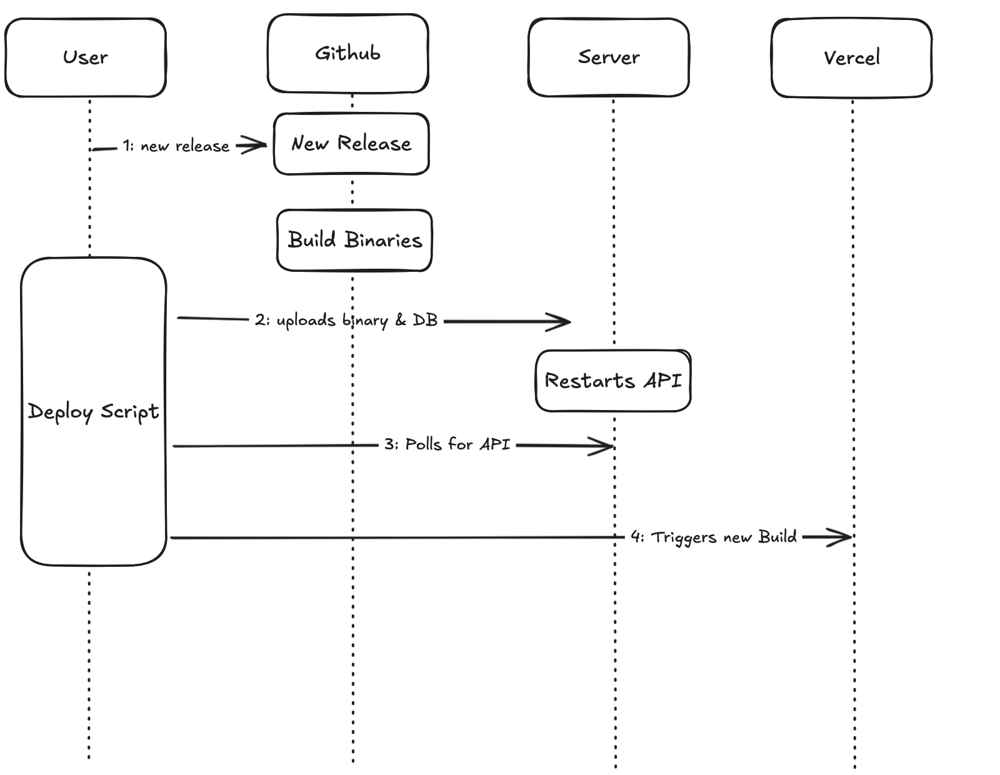

# victorhqc.com

## How it works


This website hosts my basic information as well as my photography portfolio.
For this 1st iteration the website is pretty simple. It consists of a FE using
Next.js and a BE using Rocket.rs

Originally I intended to ship the DB in each deployment to avoid having to deal
with users, sessions and uploads. But it would had require some over
complication somewhere else, or to expose the RAW DB in each deployment as it
would have been attached to each release. It also made it awkward, as each
release is tightly coupled to a specific DB and mistakes can happen.

Instead, the DB will be created on the server as any other application would,
and the CLI will deal with the upload to AWS directly. That way the REST API
does not handle any of the upload complications. This still requires to have
some user management, to protect the write routes of the API, but that can be
done in a simplistic way by having some simple key approach, if the public key
sent over the network matches the private key in the server, then the request
is allowed.

## Deployment



The deployment is initiated by a GitHub release. The CI will take care of the
rest, which is:

1. Build binaries
2. Send binaries and DB to the sever
3. Restarts API in server
4. Trigger Vercel deployment

# Development

### Requirements

- Rust >= 1.78.0
- sqlx-cli:

  ```sh
  cargo install sqlx-cli
  cargo install cargo-watch -i schema.gql -x "run -p api-victorhqc-com"
  ```

Prepare the environment variables by creating an `.env` file

```sh
cp .env.example .env
cp .cargo/config.toml.example .cargo/config.toml 
```

The `.cargo/config.toml` requires an update, replace the `<ROOT_PATH>` with the
current path you have the project saved in.

```sh
pwd
```

In unix systems it should like

```
DATABASE_URL = "sqlite:/users/user/victorhqc.com/development.db"
```

In Windows it should look like

```
DATABASE_URL = "sqlite:C:\\Users\\user\\victorhqc.com\\development.db"
```

Create the initial DB

```sh
./scripts/unix/db.sh
```

For Windows

```bat
scripts\windows\db.bat
```

## CLI Backoffice

Since this Site won't have a UI or any kind of management outside my computer,
all the CRUD operations will happen locally, and I'll just ship the DB on every
release, I have to have someway of managing it, so a simple CLI will do.

This CLI reads the EXIF information using [exiftool](https://exiftool.org/),
then stores it in the DB and uploads the file to an S3 Bucket.

For this, make sure to run the exiftool installation

```sh
./scripts/unix/exiftool.sh
```

For Windows

```bat
scripts\windows\exiftool.bat
```

And to run the CLI

```sh
cargo run -p cli-victorhqc-com
cargo run -p cli-victorhqc-com -- --help
```

## API Development

Run the project

```sh
cargo run -p api-victorhqc-com
```

## Database

Add a new migration

```sh
sqlx migrate add -r <name>
```

Run migrations again

```sh
sqlx migrate run
```
