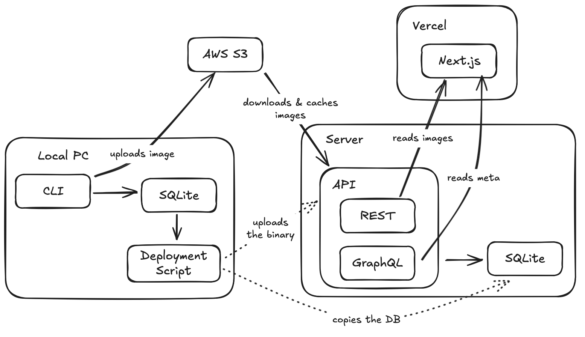
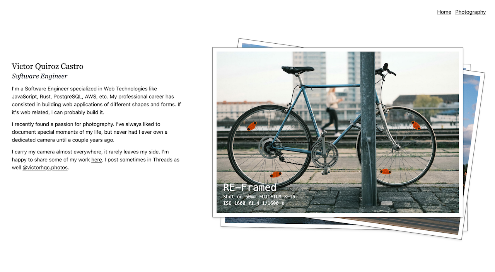

# victorhqc.com

## How it works



This website hosts my basic information as well as my photography portfolio. It
started as a simple idea and it evolved into a fairly complex application that
is in the over-engineered side. However, it was very satisfying to build, I
learned a few new things and I'm happy to see that is 90% Rust, although I had
to move the [photo stack js](https://github.com/victorhqc/victorhqc.com.libs)
code into a different repository to keep it JS from taking over :)



# Development

### Requirements

- Rust >= 1.78.0
- sqlx-cli:

  ```sh
  # The DB CLI
  cargo install sqlx-cli
  # For recompilation on code update while developing
  cargo install --locked bacon
  ```

### Setup

Run the setup script after cloning. It configures git hooks that prevent
committing unencrypted vault files.

```sh
./scripts/unix/setup-dev.sh
```

Prepare the environment variables by creating an `.env` file

```sh
cp .env.example .env
cp .cargo/config.toml.example .cargo/config.toml
```

The `.cargo/config.toml` requires an update, replace the needed keys for AWS.

## CLI Backoffice

Since this Site won't have a UI or any kind of management outside my computer,
all the CRUD operations will happen locally, and I'll just ship the DB on every
release, I have to have someway of managing it, so a simple CLI will do.

This CLI reads the EXIF information using [exiftool](https://exiftool.org/),
then stores it in the DB and uploads the file to an S3 Bucket.

For this, make sure to run the exiftool installation

```sh
./scripts/unix/exiftool.sh
```

For Windows

```bat
scripts\windows\exiftool.bat
```

And to run the CLI

```sh
cargo run -p cli-victorhqc-com
cargo run -p cli-victorhqc-com -- --help
```

## API Development

Run the project

```sh
cargo run -p api-victorhqc-com

# With hot reload
bacon
```

## Web Frontend Development

First, install the dependencies the website needs using the `web-dependencies.sh`
script, just make sure `wget` is installed, for Mac OSX do it with

```sh
brew install wget
```

And then run the script. It will download a copy of `tailwindcss` and `htmx`.
We could use a CDN, but time has proven that CDNs go down sometimes, and we want
to avoid problems caused by 3rd parties as much as possible.

```sh
./scripts/unix/web-dependencies.sh
```

Make sure the API is running and then run the following

```sh
# With hot reload
bacon web
```

## Database

Add a new migration

```sh
# Move into the core directory
cd ./core

sqlx migrate add -r <name>
```

Run migrations again

```sh
sqlx migrate run
```

Note that when adding a new query, the following needs to run

```sh
cargo sqlx prepare --workspace
```

# Compilation

The service will run in a Linux machine, so targeting that platform is imperative.

## From Mac OSX

**Requirements**

1. Musl Target

```sh
rustup target add x86_64-unknown-linux-musl
```

2. Musl Linker

```sh
brew install FiloSottile/musl-cross/musl-cross
```

**Compilation**

```sh
cargo build --release --target x86_64-unknown-linux-musl
```

# Stress Testing API

To make sure the API runs smoothly, running stress tests is encouraged.

## Requirements

- [Drill](https://github.com/fcsonline/drill)

```sh
cargo install drill
```

Copy the script and benchmark file

```sh
cp scripts/unix/run.api.example.sh scripts/unix/run.api.sh
cp stress-tests/benchmark.example.yml stress-tests/benchmark.yml
cp stress-tests/benchmark.web.example.yml stress-tests/benchmark.web.yml
```

And replace the values in the script and benchmark file

## How to run

Make sure the API is running

```sh
cargo build --release
./scripts/unix/run.api.sh
./scripts/unix/run.web.sh
```

Then run the stress tests

```sh
drill --benchmark stress-tests/benchmark.yml --stats
drill --benchmark stress-tests/benchmark.web.yml --stats
```

# Deployment

Deployment uses [Ansible](https://docs.ansible.com/). It handles both fresh machine setup and
routine releases. All playbooks live in `deploy/`.

## Requirements

- [Ansible](https://docs.ansible.com/ansible/latest/installation_guide/intro_installation.html): `brew install ansible`
- [cloudflared](https://developers.cloudflare.com/cloudflare-one/connections/connect-networks/downloads/): SSH proxy to the server
- The `lattepanda` SSH alias configured in `~/.ssh/config`

## Secrets

Secrets are stored in `deploy/inventory/group_vars/all/vault.yml`, encrypted with
[Ansible Vault](https://docs.ansible.com/ansible/latest/vault_guide/index.html).

First time setup:

```sh
cd deploy

# Fill in your real values
vi inventory/group_vars/all/vault.yml

# Encrypt the file
ansible-vault encrypt inventory/group_vars/all/vault.yml
```

To edit secrets later:

```sh
ansible-vault edit inventory/group_vars/all/vault.yml
```

## Provision a New Machine

This installs packages, creates users, sets up nginx, deploys systemd services,
and runs the first deploy.

```sh
cd deploy
ansible-playbook playbooks/setup.yml --ask-vault-pass --ask-become-pass
```

Pass `-e install_web_deps=true` to also install web dependencies (tailwindcss,
htmx, etc.) before building.

## Deploy a Release

This builds the project locally, uploads binaries and assets, backs up the
database, and restarts the services.

```sh
cd deploy
ansible-playbook playbooks/deploy.yml --ask-vault-pass --ask-become-pass
```

If you already ran `cargo build --release --target x86_64-unknown-linux-musl`
and want to skip the build, add `--skip-tags build`:

```sh
cd deploy
ansible-playbook playbooks/deploy.yml --ask-vault-pass --ask-become-pass --skip-tags build
```

## Service Management

Both services run under `systemd`. Check their status with:

```sh
systemctl status victorhqc-api
systemctl status victorhqc-web
```
