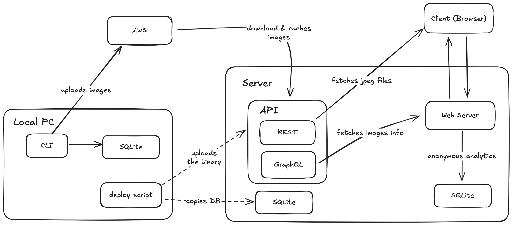

# victorhqc.com

## How it works



This website hosts my basic information as well as my photography portfolio. It
started as a simple idea and it evolved into a fairly complex application that
is in the over-engineered side. However, it was very satisfying to build, I
learned a few new things and I'm happy to see that is 90% Rust, although I had
to move the photo stack js code into a different repository to keep it JS from
taking over :)


## Deployment

(TODO)

The deployment is initiated by a GitHub release. It will create the binary of
the API, then the deployment script must be executed, as it takes care of:

1. Send binaries and DB to the sever
2. Restarts API in server
3. Trigger Vercel deployment

```sh
./scripts/unix/deploy.sh --version=<VERSION> --db=<DB_PATH>
```

# Development

### Requirements

- Rust >= 1.78.0
- sqlx-cli:

  ```sh
  # The DB CLI
  cargo install sqlx-cli
  # For recompilation on code update while developing
  cargo install --locked bacon
  ```

Prepare the environment variables by creating an `.env` file

```sh
cp .env.example .env
cp .cargo/config.toml.example .cargo/config.toml 
```

The `.cargo/config.toml` requires an update, replace the needed keys for AWS.

## CLI Backoffice

Since this Site won't have a UI or any kind of management outside my computer,
all the CRUD operations will happen locally, and I'll just ship the DB on every
release, I have to have someway of managing it, so a simple CLI will do.

This CLI reads the EXIF information using [exiftool](https://exiftool.org/),
then stores it in the DB and uploads the file to an S3 Bucket.

For this, make sure to run the exiftool installation

```sh
./scripts/unix/exiftool.sh
```

For Windows

```bat
scripts\windows\exiftool.bat
```

And to run the CLI

```sh
cargo run -p cli-victorhqc-com
cargo run -p cli-victorhqc-com -- --help
```

## API Development

Run the project

```sh
cargo run -p api-victorhqc-com

# With hot reload
bacon
```

## Web Frontend Development

First, install the dependencies the website needs using the `web-dependencies.sh` script, just make sure `wget` is installed,
for Mac OSX do it with

```sh
brew install wget
```

And then run the script. It will download a copy of `tailwindcss` and `htmx`. We could use a CDN, but time has proven that
CDNs go down sometimes, and we want to avoid problems caused by 3rd parties as much as possible.

```sh
./scripts/unix/web-dependencies.sh
```


Make sure the API is running and then run the following

```sh
# With hot reload
bacon web
```

## Database

Add a new migration

```sh
sqlx migrate add -r <name>
```

Run migrations again

```sh
sqlx migrate run
```

# Compilation

The service will run in a Linux machine, so targeting that platform is imperative.

## From Mac OSX

**Requirements**

1. Musl Target
  ```sh
  rustup target add x86_64-unknown-linux-musl
  ```
2. Musl Linker
  ```sh
  brew install FiloSottile/musl-cross/musl-cross
  ```

**Compilation**

```sh
cargo build --release --target x86_64-unknown-linux-musl
```

# Stress Testing API

To make sure the API runs smoothly, running stress tests is encouraged.

## Requirements

- [Drill](https://github.com/fcsonline/drill)

```sh
cargo install drill
```

Copy the script and benchmark file

```sh
cp scripts/unix/run.api.example.sh scripts/unix/run.api.sh
cp stress-tests/benchmark.example.yml stress-tests/benchmark.yml
cp stress-tests/benchmark.web.example.yml stress-tests/benchmark.web.yml
```

And replace the values in the script and benchmark file

## How to run

Make sure the API is running

```sh
cargo build --release
./scripts/unix/run.api.sh
./scripts/unix/run.web.sh
```

Then run the stress tests

```sh
drill --benchmark stress-tests/benchmark.yml --stats
drill --benchmark stress-tests/benchmark.web.yml --stats
```
